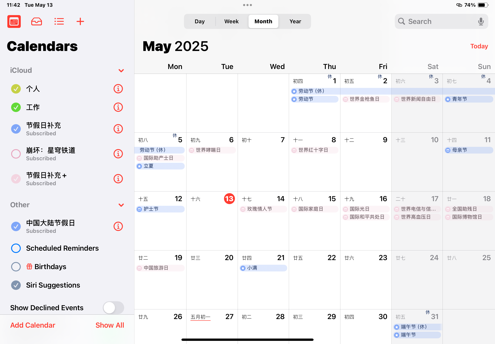
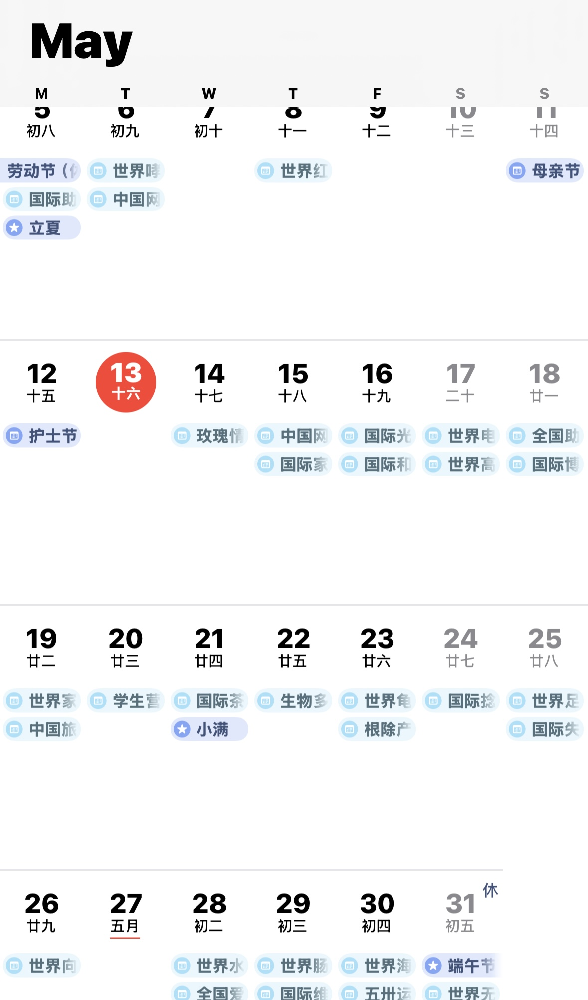

# fixcalendar

> “我日历上怎么没有母亲节啊？”

本项目提供 `.ics` iCalendar 日历订阅文件，用于补充 Apple 设备日历缺失的节假日。  
订阅链接后就会自动更新，请把麻烦的维护工作全都交给本 Git 主吧！ ✪ ω ✪

补充的多是大陆官方没有确立但民间广泛认同的节假日。  
如信息有误，欢迎随时发邮件~~骚扰~~提醒我 waitwill@icloud.com (/≧▽≦)/  

<table>
  <tr>
    <td></td><td></td>
  </tr>
</table>

## `cn.ics` 补充节假日列表

<table>
<tr><td rowspan="11">西方/国际节日</td><td>母亲节</td><td>05月的第 2 个星期日</td></tr>
<tr><td>父亲节</td><td>06月的第 3 个星期日</td></tr>
<tr><td>感恩节</td><td>11月的第 4 个星期四</td></tr>
<tr><td>情人节</td><td>02月14日</td></tr>
<tr><td>白色情人节</td><td>03月14日</td></tr>
<tr><td>植树节</td><td>03月12日</td></tr>
<tr><td>愚人节</td><td>04月01日</td></tr>
<tr><td>万圣夜</td><td>10月31日</td></tr>
<tr><td>万圣节</td><td>11月01日</td></tr>
<tr><td>平安夜</td><td>12月24日</td></tr>
<tr><td>圣诞节</td><td>12月25日</td></tr>

<tr><td rowspan="6">传统节日/民族特色节日</td><td>中元节</td><td>农历七月十五</td></tr>
<tr><td>腊八节</td><td>农历腊月初八</td></tr>
<tr><td>北小年</td><td>农历腊月二十三</td></tr>
<tr><td>南小年</td><td>农历腊月二十四</td></tr>
<tr><td>龙抬头</td><td>农历二月初二</td></tr>
<tr><td>火把节</td><td>农历六月二十四</td></tr>

<tr><td>夏三伏和冬九九</td><td colspan="2">每个农历年年初更新对应年份的夏三伏和冬九九</td></tr>

<tr><td rowspan="6">行业性节日</td><td>教师节</td><td>09月10日</td></tr>
<tr><td>记者节</td><td>10月08日</td></tr>
<tr><td>医师节</td><td>08月19日</td></tr>
<tr><td>人民警察节</td><td>01月10日</td></tr>
<tr><td>护士节</td><td>05月12日</td></tr>
<tr><td>农民丰收节</td><td>秋分</td></tr>
</table>

## `addition.cn.ics` 补充节假日列表

> 持续补充中...

<table>
<tr><td colspan="99">五月</td></tr>
<tr>
<td>世界红十字日</td>
<td>世界哮喘日</td>
<td>中国网络物流节</td>
<td>世界哮喘日</td>
<td>全国助残日</td>
<td>世界水獭日</td>
<td>世界金枪鱼日</td>
<td>世界新闻自由日</td>
<td>国际助产士日</td>
<td>中国网络物流节</td>
<td>世界红十字日</td>
<td>玫瑰情人节</td>
<td>国际家庭日</td>
<td>国际光日</td>
<td>国际和平共处日</td>
<td>世界电信与信息社会日</td>
<td>世界高血压日</td>
<td>国际博物馆日</td>
<td>中国旅游日</td>
<td>世界家庭医生日</td>
<td>学生营养日</td>
<td>国际茶日</td>
<td>生物多样性日</td>
<td>世界龟鳖日</td>
<td>根除产科瘘国际日</td>
<td>国际捻角山羊日</td>
<td>世界足球日</td>
<td>国际失踪儿童日</td>
<td>世界向人体条件挑战日</td>
<td>全国爱发日</td>
<td>世界肠道健康日</td>
<td>国际维和人员日</td>
<td>五卅运动纪念日</td>
<td>世界海狮日</td>
<td>世界无烟日</td>
</tr>

<tr><td colspan="99">六月</td></tr>
<tr>
<td>全球跑步日</td>
<td>文化和自然遗产日</td>
<td>世界珊瑚礁日</td>
<td>世界自行车日</td>
<td>世界苹果酒日</td>
<td>世界环境日</td>
<td>全国爱眼日</td>
<td>联合国俄文日</td>
<td>高考</td>
<td>世界海洋日</td>
<td>国际档案日</td>
<td>中国人口日</td>
<td>国际游玩日</td>
<td>世界无童工日</td>
<td>国际白化病宣传日</td>
<td>世界献血者日</td>
<td>健康素食日</td>
<td>国际家庭汇款日</td>
<td>世界防治沙漠化和干旱日</td>
<td>国际野餐日</td>
<td>国际寿司日</td>
<td>世界难民日</td>
<td>世界渐冻人日</td>
<td>中国儿童慈善活动日</td>
<td>世界骆驼日</td>
<td>国际奥林匹克日</td>
<td>联合国公务员日</td>
<td>女外交官国际日</td>
<td>全国土地日</td>
<td>世界海员日</td>
<td>国际禁毒日</td>
<td>联合国宪章日</td>
<td>中小微企业日</td>
<td>国际热带日</td>
<td>国际小行星日</td>
</tr>

<tr><td colspan="99">七月</td></tr>
<tr>
<td>国际合作社日</td>
<td>香港回归日</td>
<td>体育记者日</td>
<td>世界 UFO 日</td>
<td>国际接吻日</td>
<td>世界巧克力日</td>
<td>世界过敏性疾病日</td>
<td>世界人口日</td>
<td>世界防治沙尘暴日</td>
<td>银色情人节</td>
<td>世界青年技能日</td>
<td>国际冰壶日</td>
<td>世界表情符号日</td>
<td>纳尔逊·曼德拉国际日</td>
<td>人类月球日</td>
<td>国际象棋日</td>
<td>清洁工日</td>
<td>世界预防溺水日</td>
<td>粤语日</td>
<td>世界语创立日</td>
<td>世界肝炎日</td>
<td>世界爱虎日</td>
<td>国际友谊日</td>
</tr>

<tr><td colspan="99">八月</td></tr>
<tr>
<td>待更新</td>
</tr>

<tr><td colspan="99">农历节日 · 2025</td></tr>
<tr>
<td>观世音菩萨成道日</td>
</tr>
</table>

## 食用方法（以 iOS 日历举例，其他平台同理）

> ### `cn.ics`
> *以下订阅地址内容相同，选取一个可用的就好*  
> 订阅地址1：Github Pages：https://willsat.github.io/fixcalendar/cn.ics  
> 订阅地址2：Github Raw：https://raw.githubusercontent.com/WillSat/fixcalendar/refs/heads/main/cn.ics  
> *由于大陆 GitHub Pages 遭到 DNS 污染，可能会订阅失败。故提供 Cloudflare Pages 备份*  
> 订阅地址3：https://fixcalendar.pages.dev/cn.ics

> ### `addition.cn.ics`
> *以下订阅地址内容相同，选取一个可用的就好*  
> 订阅地址1：Github Pages：https://willsat.github.io/fixcalendar/addition.cn.ics  
> 订阅地址2：Github Raw：https://raw.githubusercontent.com/WillSat/fixcalendar/refs/heads/main/addition.cn.ics  
> *由于大陆 GitHub Pages 遭到 DNS 污染，可能会订阅失败。故提供 Cloudflare Pages 备份*  
> 订阅地址3：https://fixcalendar.pages.dev/addition.cn.ics  

1. 打开日历应用；
2. 点击应用下方 `日历` 字样，点击左下角添加日历；
3. 选择添加订阅日历，粘贴上订阅链接订阅即可。