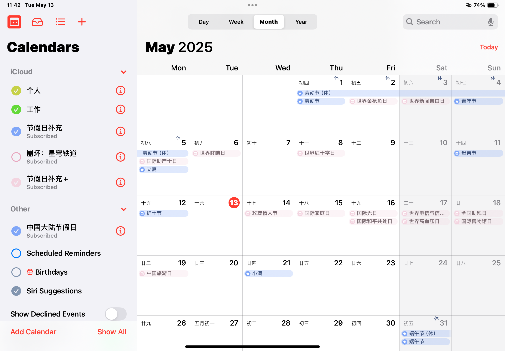
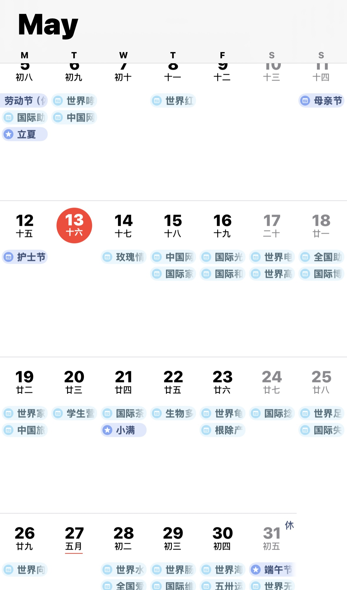

# fixcalendar

> “我日历上怎么没有父/母亲节啊？”

本项目提供 `.ics` iCalendar 日历订阅文件，用于补充 Apple 设备日历缺失的节假日。  
订阅链接后就会自动更新，请把麻烦的维护工作全都交给本 Git 主吧！ (✪ ω ✪)

补充的多是大陆官方没有确立但民间广泛认同的节假日。  
如信息有误，欢迎随时发邮件~~骚扰~~提醒我 waitwill@icloud.com (/≧▽≦)/  

<table>
  <tr>
    <td></td><td></td>
  </tr>
</table>

## `cn.ics` 补充节假日列表

> 已补充至 2030 年

<table>
<tr><td rowspan="12">西方/国际节日</td><td>母亲节</td><td>五月的第 2 个星期日</td></tr>
<tr><td>父亲节</td><td>六月的第 3 个星期日</td></tr>
<tr><td>感恩节</td><td>十一月的第 4 个星期四</td></tr>
<tr><td>情人节</td><td>2月14日</td></tr>
<tr><td>白色情人节</td><td>03月14日</td></tr>
<tr><td>植树节</td><td>03月12日</td></tr>
<tr><td>愚人节</td><td>04月01日</td></tr>
<tr><td>万圣夜</td><td>10月31日</td></tr>
<tr><td>万圣节</td><td>11月01日</td></tr>
<tr><td>平安夜</td><td>12月24日</td></tr>
<tr><td>圣诞节</td><td>12月25日</td></tr>
<tr><td>复活节</td><td>春分月圆之后第一个星期日</td></tr>

<tr><td rowspan="5">传统/民族特色节日</td><td>中元节</td><td>农历七月十五</td></tr>
<tr><td>腊八节</td><td>农历腊月初八</td></tr>
<tr><td>北小年</td><td>农历腊月二十三</td></tr>
<tr><td>南小年</td><td>农历腊月二十四</td></tr>
<tr><td>龙抬头</td><td>农历二月初二</td></tr>

<tr><td>夏三伏/冬九九</td><td colspan="2">每个农历年年初更新对应年份的夏三伏和冬九九</td></tr>

<tr><td rowspan="6">行业节日</td><td>教师节</td><td>09月10日</td></tr>
<tr><td>记者节</td><td>11月08日</td></tr>
<tr><td>医师节</td><td>08月19日</td></tr>
<tr><td>人民警察节</td><td>01月10日</td></tr>
<tr><td>护士节</td><td>05月12日</td></tr>
<tr><td>农民丰收节</td><td>秋分</td></tr>
</table>

## 食用方法（以 iOS 日历举例，其他平台同理）

> *以下订阅地址内容相同，选取一个可用的就好*  
> 订阅地址1：Github Pages：https://willsat.github.io/fixcalendar/cn.ics  
> 订阅地址2：Github Raw：https://raw.githubusercontent.com/WillSat/fixcalendar/refs/heads/main/cn.ics  

1. 打开日历应用；
2. 点击应用下方 `日历` 字样，点击左下角添加日历；
3. 选择添加订阅日历，粘贴上订阅链接订阅即可。

---

## ICS 日历编辑器（gen/）

> 一个 iCalendar (.ics) 日历编辑器，位于仓库 gen/ 目录。

在线地址：**https://willsat.github.io/fixcalendar/gen/index.html**（GitHub Pages，打开即用，无需构建）